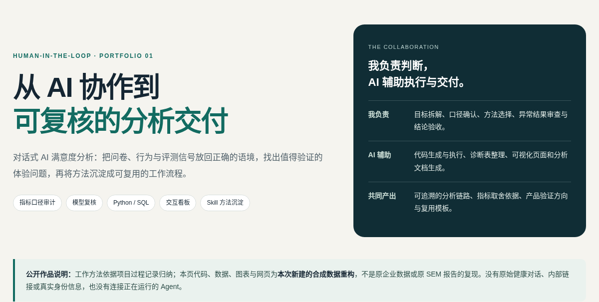
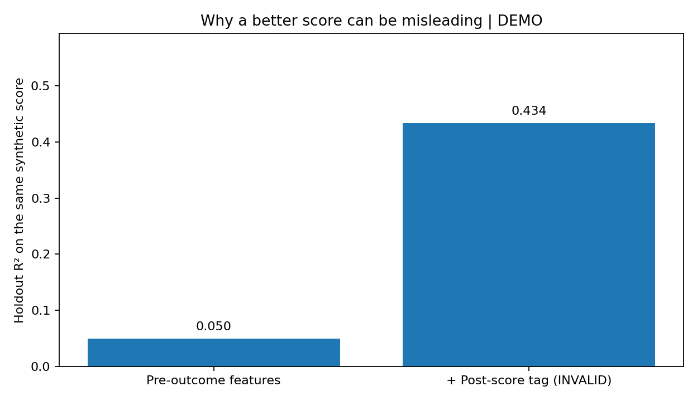

# AI 协作满意度分析作品集

**把 AI 用于执行，把人的判断用于口径、模型与结论。**

一个以真实工作方法为背景、使用**完全合成数据**重构的对话式 AI 满意度分析作品。展示人机协作、数据审计、标签泄漏检查、可解释建模、双信号评测与交互式交付，而不是包装一个无法核验的“高准确率模型”。

> **证据边界**：项目经历摘要来自作者提供的过程记录；本仓库的 Python、SQL、数据、网页与测试均为作品展示新建，不是原公司的生产代码、原始数据或原 SEM 报告的复现。网页中的所有数值与图表均由合成数据计算。不包含真实对话、个人信息、业务内部链接、密钥或企业专有 Skill。当前版本不连接任何外部 Agent，也不调用模型 API。

[打开作品页面](docs/index.html) · [完整项目叙事](docs/case-study.md) · [方法与边界](docs/methodology.md) · [代码导读](docs/code-walkthrough.md) · [逐步 Notebook](notebooks/01_synthetic_walkthrough.ipynb) · [发布步骤](docs/publish-guide.md)

**查看方式**：GitHub 文件浏览页里的 HTML 链接不一定直接渲染网页；下载后用浏览器打开，或按发布步骤启用 GitHub Pages。



*本次新建的公开作品页面，不是原内部看板截图。*

## 这个项目解决什么问题

对话式产品的问卷评分、行为日志与独立评测并不总是一致。分析的任务不是把所有字段塞进模型，而是确认哪些变量能被信任、哪些关系具有解释价值，以及哪些产品建议还需要进一步验证。

我的责任是提出分析目标、确认字段口径、审查模型方案、核对异常结果，并将结果转成业务能够复核的报告。Agent 辅助生成与执行代码、批量生成诊断结果、整理反馈、构建可视化页面及沉淀流程。

## 三个核心展示点

| 展示点 | 我的判断 | Agent / 工具执行 |
|---|---|---|
| 先审数据，再做模型 | 区分匿名标识、会话粒度、常量字段、问卷后标签与下游结果 | 全字段盘点、重复检查、数据质量表与排除清单 |
| 不用高拟合掩盖错误 | 识别评分门控标签、审查异常符号、比较不同模型假设 | 门控校验、OLS 与有序 Logit 演示、分组留出与结果表 |
| 交付可复核的分析 | 明确结论边界、审查建议优先级、确认发布范围 | 交互页面、图表、SQL / Python、流程 Skill 与复盘模板 |

## 本仓库实际实现了什么

- 合成会话与事件生成，固定随机种子；字段与数据量不是内部原表的复制。
- 逐字段去向清单、会话去重、无效评分剔除、匿名用户分组、门控标签拦截。
- SQLite 事件聚合，排除问卷之后的事件；与 Python 数据逐项核验。
- 按参与者分组划分训练/留出集，训练集内拟合 P99 缩尾与标准化；OLS 条件关联、用户聚类区间、有序 Logit 敏感性演示。
- 明确标为**无效预测方案**的标签泄漏反例；即使留出集评分升高，也不应采用结果之后的信息。
- 自包含 HTML：样本筛选、动态指标汇总、字段搜索/分类/排序、CSV 导出、代码查看、四张统计图。
- 可复用的分析 Skill 文本、人工决策检查点、工作偏好与周报模板。它们是本次整理的公开模板，不是平台 Skill 的原文件。



*图：相同留出样本上的模型比较。含评分后标签的方案仅用于展示泄漏风险，不能作为模型性能成果。数值由 `python -m src.run_demo` 生成。*

## 一键运行

建议使用 Python 3.11–3.13；交付包在 Python 3.13.5 与固定依赖版本下执行过。其他 Python / 操作系统组合需要自行验证。

```bash
python -m venv .venv
# macOS / Linux
source .venv/bin/activate
# Windows PowerShell 使用：.venv\Scripts\Activate.ps1
python -m pip install -r requirements-dev.txt
python -m src.run_demo
python -m pytest -q
```

直接用浏览器打开 `docs/index.html`，无需密钥、服务器、网络或数据库账户。也可以启动本地预览：

```bash
python -m http.server 8000 --directory docs
```

运行可修改演示规模，但这不是对原业务规模的复现：

```bash
python -m src.run_demo --samples 2400 --seed 42
```

## 目录

```text
README.md
src/                         合成数据、审计、SQL 执行、建模、绘图与网页构建
sql/session_features.sql     可实际运行的 SQLite 聚合示例
skills/satisfaction-analysis/SKILL.md
prompts/analysis_checkpoints.md
memory/                      非敏感偏好与决策日志示例
notebooks/                   按步骤阅读的展示 Notebook
assets/                      由代码生成的四张统计图
outputs/                     实际运行结果、诊断 CSV、JSON 与复盘示例
data/synthetic/             完全合成的会话与事件数据
docs/index.html             自包含公开作品页面
docs/case-study.md           项目叙事与人机分工
docs/methodology.md          统计边界、未复现内容与参考文档
docs/publish-guide.md        GitHub / Pages 发布方式
 tests/                      数据与流程检查
```

## 不能从这个作品推断什么

这不是临床评估工具，不提供医疗诊断；不证明任何真实产品的安全性或有效性。演示结果不等于业务收益。模型系数不是因果提升量，较高拟合度不是测量有效性的充分证据。没有在本仓库实现原项目 SEM、RAG、MCP 服务或多 Agent 编排，也不据此宣称相关开发经验。

发布前请阅读 [公开发布检查清单](docs/publication-checklist.md)。
